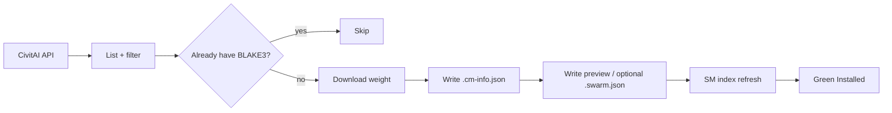

<p align="center">
  
</p>

<p align="center">
  <strong>Batch-download CivitAI models the Stability Matrix way.</strong><br/>
  Green <em>Installed</em> badges. Connected metadata. Resume-friendly. Cross-platform.
</p>

<p align="center">
  
  <a href="https://www.python.org/"></a>
  <a href="LICENSE"></a>
  
  
</p>

<p align="center">
  <a href="https://linktr.ee/ArturoWolff">Linktree</a> ·
  <a href="https://ko-fi.com/arturowolff">Ko-fi</a> ·
  <a href="ROADMAP.md">Roadmap</a> ·
  <a href="docs/GUIDE.md">Guide</a> ·
  <a href="docs/STABILITY-MATRIX.md">SM Compatibility</a>
</p>

---

## Why CivitMatrix?

Stability Matrix’s model browser marks a model **Installed** when the local file’s **BLAKE3** hash matches CivitAI. You don’t have to click download one-by-one in the UI.

CivitMatrix:

1. Lists models from the CivitAI API (any base model / type — Anima LoRAs are the showcase default)
2. Picks the newest version that matches your base model
3. Downloads weights into your SM Models folder
4. Writes **SM-native sidecars**: `.cm-info.json` (with `SourceUrl`) + preview (extension matches real media type); optional `.swarm.json` with `--write-swarm` / `WRITE_SWARM=1`
5. Skips what you already have; logs failures for later retries
6. Opens a **local Win95 batch UI** by default (`127.0.0.1`) and exposes a **live control plane** (`job.json`, cancel / pause / status) for long CLI runs

<p align="center">
  
</p>



---

## Quickstart

### 1. Clone

```bash
git clone https://github.com/ArturoWolff/CivitMatrix.git
cd CivitMatrix
cp .env.example .env
```

### 2. Add your API key

Edit `.env` and set:

```env
CIVITAI_API_KEY=your_key_here
LORA_DIR=/path/to/StabilityMatrix/Data/Models/Lora
```

> Get a key under CivitAI → Account → API Keys. **Never commit `.env`.**

### 3. Run

**Linux / macOS**

```bash
chmod +x run.sh
./run.sh                         # opens local Win95 UI on 127.0.0.1:7860
./run.sh --cli --dry-run --limit 5
./run.sh --cli                   # headless full batch
```

**Windows (PowerShell)**

```powershell
.\run.ps1                        # opens local Win95 UI
.\run.ps1 --cli --dry-run --limit 5
.\run.ps1 --cli
```

**Any platform (Python module)**

```bash
python3 -m venv .venv
# Linux/macOS: source .venv/bin/activate
# Windows:     .venv\Scripts\Activate.ps1
pip install -e .
python -m civitmatrix --help
```

Then refresh Stability Matrix’s model index (or restart SM) to see green **Installed** labels.

---

## Personalize

| Knob | Env var | CLI | Default |
|------|---------|-----|---------|
| API key | `CIVITAI_API_KEY` | — | *(required)* |
| API host | `CIVITAI_BASE_URL` | — | `https://civitai.red` |
| Output folder | `LORA_DIR` | `--out` | `./downloads/Lora` |
| Base model | `BASE_MODEL` | `--base-model` | `Anima` |
| Model type | `MODEL_TYPE` | `--type` | `LORA` |
| Sort | `SORT` | `--sort` | `Highest Rated` |
| NSFW | `NSFW` | `--nsfw` / `--no-nsfw` | `true` |
| Match base version | `MATCH_BASE_VERSION` | `--match-base-version` | `true` |
| Concurrency | `MAX_CONCURRENT` | `--concurrency` | `2` |
| Download rate limit (MiB/s, global) | `DOWNLOAD_RATE_LIMIT_MBS` | `--download-rate-limit` | `0` (unlimited; example uses `5`) |
| Keep preview temps | `KEEP_PARTIALS` | `--keep-partials` | `false` |
| Range-resume weights | `RESUME_PARTIALS` | `--resume-partials` / `--no-resume-partials` | `true` |
| Skip BLAKE3 verify | `SKIP_VERIFY` | `--skip-verify` | `false` |

Examples:

```bash
# Showcase: all Anima LoRAs (SFW + NSFW)
./run.sh --cli --base-model Anima --type LORA

# Illustrious checkpoints, most downloaded first
./run.sh --cli --base-model Illustrious --type Checkpoint --sort "Most Downloaded"

# Dry-run + retry later
./run.sh --cli --dry-run --limit 20
./run.sh --cli --retry-failed
```

### Control a long run (second terminal)

No API key needed for these:

```bash
./run.sh --status              # human summary of logs/job.json
./run.sh --status --json       # machine-readable snapshot
./run.sh --pause               # finish in-flight file, then wait
./run.sh --resume              # continue
./run.sh --cancel              # cooperative stop (exit 4); Ctrl+C does the same

# Fix incomplete sidecars / orphans in an existing library
./run.sh --cli --heal --dry-run
./run.sh --cli --heal
./run.sh --cli --heal --purge-orphans

# Sort into characters/ styles/ concepts/ clothes/ uncategorized/ (dry-run; add --apply to move)
./run.sh --cli --categorize
./run.sh --cli --categorize --apply
```

Full walkthrough: [docs/GUIDE.md](docs/GUIDE.md) · Filters: [docs/FILTERS.md](docs/FILTERS.md)

---

## Stability Matrix compatibility

Downloads land as:

```text
YourModels/Lora/
  my-lora.safetensors    # or .gguf when that is the primary file
  my-lora.cm-info.json   # SourceUrl → Civit model page
  my-lora.swarm.json     # optional: --write-swarm / WRITE_SWARM=1
  my-lora.preview.png    # or .jpeg / .webp / .mp4 — sniffed from content
```

That matches what SM writes when you download from its browser — so hashes index cleanly and connected metadata (triggers, version ids, etc.) stays available. Optional: `./run.sh --cli --strip-swarm-thumbnails` removes legacy `modelspec.thumbnail` blobs; `./run.sh --cli --fix-swarm-architecture` sets SwarmUI `modelspec.architecture` from local `.cm-info.json` (no redownload).

Deep dive: [docs/STABILITY-MATRIX.md](docs/STABILITY-MATRIX.md)

---

## Logs & control plane

| File | Purpose |
|------|---------|
| `logs/job.json` | Live phase (`running` while streaming), counts, current model, timestamps |
| `logs/events.jsonl` | Structured diary (`stream_start`, `listing_progress`, `download_*`, `fail`, `paused`, …) |
| `logs/failed.jsonl` | Failures with `retryable` flag — feed `--retry-failed` |
| `logs/manifest.jsonl` | Success rows + `sortHints` (feeds `--categorize`) |
| `logs/run.log` | Console transcript |
| `logs/cancel.request` / `pause.request` | Flags written by `--cancel` / `--pause` |
| `<out>/.civitmatrix.lock` | One writer per output folder |

On start (after lock), preview download temps are purged; **weight** `*.safetensors.partial` / `*.gguf.partial` are kept and **HTTP Range-resumed** on the next download (`download_resume` event). Use `--no-resume-partials` to force a full re-get. `--keep-partials` also keeps preview temps.

Catalog processing is **streamed**: models are submitted to the worker pool as listing pages arrive (no full catalog in RAM). Verified local files are still skipped on restart (recursive scan of the out dir, including SM category subfolders).

**Listing cache (opt-in):** `--use-listing-cache` reuses a complete page cache under `logs/listing-cache/` for the current filters; default runs always re-list. `--refresh-listing` forces a fresh API list (and rewrites the cache when caching is on).

**Disk floor:** `--disk-floor-gib` (default 2; env `DISK_FLOOR_GIB`; `0`=off). Below floor → runner exit **5**. Soft warn when a file’s known size exceeds free space.

**Download rate limit:** `--download-rate-limit` / env `DOWNLOAD_RATE_LIMIT_MBS` (MiB/s, **global** across workers; `0`=unlimited). Caps total CDN/weight bandwidth so the rest of the network stays usable.

**Progress:** stderr `\r` line + `download_progress` events; `failed.jsonl` rows share `eventId` with fail events.

**`--status` exit codes:** `0` done · `1` missing job · `2` error · `4` cancelled · `5` paused · `6` active  
**Runner exits:** `0` ok · `2` missing API key · `3` lock busy · `4` cancelled · `5` disk/preflight · `130` forced second Ctrl+C

---

## Roadmap (teaser)

**v1.0.0** ships filters, categorize, Win95 UI, SM helpers, and download rate limits. Highlights:

- **Filters** — `--min-downloads` / `--min-likes` / `--base-only` / `--max-nsfw-level` / `--filter-preset` (+ tags, category, users, format, date range)  
- **Categorize** — `--categorize` (dry-run) / `--categorize --apply`; recursive local index  
- **GUI** — `./run.sh` opens Win95 UI; `./run.sh --cli` for scripts  
- **SM hooks** — `--update-only`, `sm_refresh_hint`, `--sm-parity`, `--import-sm-manifest`  

See the full plan: [ROADMAP.md](ROADMAP.md)

---

## Support the project

If CivitMatrix saves you hours of clicking:

- **Linktree:** [linktr.ee/ArturoWolff](https://linktr.ee/ArturoWolff)  
- **Ko-fi:** [ko-fi.com/arturowolff](https://ko-fi.com/arturowolff)

---

## Disclaimer

Use CivitAI’s API responsibly and within their terms. Early-access / Buzz-gated / private files may fail — those rows land in `logs/failed.jsonl` for later. This project is not affiliated with CivitAI or LykosAI / Stability Matrix.

## License

[MIT](LICENSE) © Arturo Wolff
