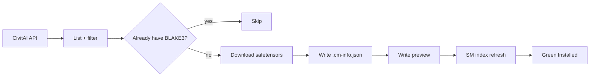

<p align="center">
  
</p>

<p align="center">
  <strong>Batch-download CivitAI models the Stability Matrix way.</strong><br/>
  Green <em>Installed</em> badges. Connected metadata. Resume-friendly. Cross-platform.
</p>

<p align="center">
  <a href="https://www.python.org/"></a>
  <a href="LICENSE"></a>
  
  
</p>

<p align="center">
  <a href="https://linktr.ee/ArturoWolff">Linktree</a> ·
  <a href="https://ko-fi.com/arturowolff">Ko-fi</a> ·
  <a href="ROADMAP.md">Roadmap</a> ·
  <a href="docs/GUIDE.md">Guide</a> ·
  <a href="docs/STABILITY-MATRIX.md">SM Compatibility</a>
</p>

---

## Why CivitMatrix?

Stability Matrix’s model browser marks a model **Installed** when the local file’s **BLAKE3** hash matches CivitAI. You don’t have to click download one-by-one in the UI.

CivitMatrix:

1. Lists models from the CivitAI API (any base model / type — Anima LoRAs are the showcase default)
2. Picks the newest version that matches your base model
3. Downloads weights into your SM Models folder
4. Writes **SM-native sidecars**: `.cm-info.json` + preview image
5. Skips what you already have; logs failures for later retries

<p align="center">
  
</p>



---

## Quickstart

### 1. Clone

```bash
git clone https://github.com/ArturoWolff/civitmatrix.git
cd civitmatrix
cp .env.example .env
```

### 2. Add your API key

Edit `.env` and set:

```env
CIVITAI_API_KEY=your_key_here
LORA_DIR=/path/to/StabilityMatrix/Data/Models/Lora
```

> Get a key under CivitAI → Account → API Keys. **Never commit `.env`.**

### 3. Run

**Linux / macOS**

```bash
chmod +x run.sh
./run.sh --dry-run --limit 5
./run.sh
```

**Windows (PowerShell)**

```powershell
.\run.ps1 --dry-run --limit 5
.\run.ps1
```

**Any platform (Python module)**

```bash
python3 -m venv .venv
# Linux/macOS: source .venv/bin/activate
# Windows:     .venv\Scripts\Activate.ps1
pip install -e .
python -m civitmatrix --help
```

Then refresh Stability Matrix’s model index (or restart SM) to see green **Installed** labels.

---

## Personalize

| Knob | Env var | CLI | Default |
|------|---------|-----|---------|
| API key | `CIVITAI_API_KEY` | — | *(required)* |
| API host | `CIVITAI_BASE_URL` | — | `https://civitai.red` |
| Output folder | `LORA_DIR` | `--out` | `./downloads/Lora` |
| Base model | `BASE_MODEL` | `--base-model` | `Anima` |
| Model type | `MODEL_TYPE` | `--type` | `LORA` |
| Sort | `SORT` | `--sort` | `Highest Rated` |
| NSFW | `NSFW` | `--nsfw` / `--no-nsfw` | `true` |
| Match base version | `MATCH_BASE_VERSION` | `--match-base-version` | `true` |
| Concurrency | `MAX_CONCURRENT` | `--concurrency` | `2` |

Examples:

```bash
# Showcase: all Anima LoRAs (SFW + NSFW)
./run.sh --base-model Anima --type LORA

# Illustrious checkpoints, most downloaded first
./run.sh --base-model Illustrious --type Checkpoint --sort "Most Downloaded"

# Dry-run + retry later
./run.sh --dry-run --limit 20
./run.sh --retry-failed
```

Full walkthrough: [docs/GUIDE.md](docs/GUIDE.md) · Filters: [docs/FILTERS.md](docs/FILTERS.md)

---

## Stability Matrix compatibility

Downloads land as:

```text
YourModels/Lora/
  my-lora.safetensors
  my-lora.cm-info.json
  my-lora.preview.jpeg
```

That matches what SM writes when you download from its browser — so hashes index cleanly and connected metadata (triggers, version ids, etc.) stays available.

Deep dive: [docs/STABILITY-MATRIX.md](docs/STABILITY-MATRIX.md)

---

## Logs for retries & future sorting

| File | Purpose |
|------|---------|
| `logs/failed.jsonl` | Failures with `retryable` flag — feed `--retry-failed` |
| `logs/manifest.jsonl` | Success rows + `sortHints` for upcoming categorizing |
| `logs/run.log` | Console transcript |

---

## Roadmap (teaser)

- **Filters** — tags, min downloads, base-only, creators  
- **Categorizing** — auto-bucket into characters / styles / concepts / clothes  
- **GUI** — local queue + progress + folder picker  
- **Deeper SM hooks** — index refresh helpers, update-only mode  

See the full plan: [ROADMAP.md](ROADMAP.md)

---

## Support the project

If CivitMatrix saves you hours of clicking:

- **Linktree:** [linktr.ee/ArturoWolff](https://linktr.ee/ArturoWolff)  
- **Ko-fi:** [ko-fi.com/arturowolff](https://ko-fi.com/arturowolff)

---

## Disclaimer

Use CivitAI’s API responsibly and within their terms. Early-access / Buzz-gated / private files may fail — those rows land in `logs/failed.jsonl` for later. This project is not affiliated with CivitAI or LykosAI / Stability Matrix.

## License

[MIT](LICENSE) © Arturo Wolff
